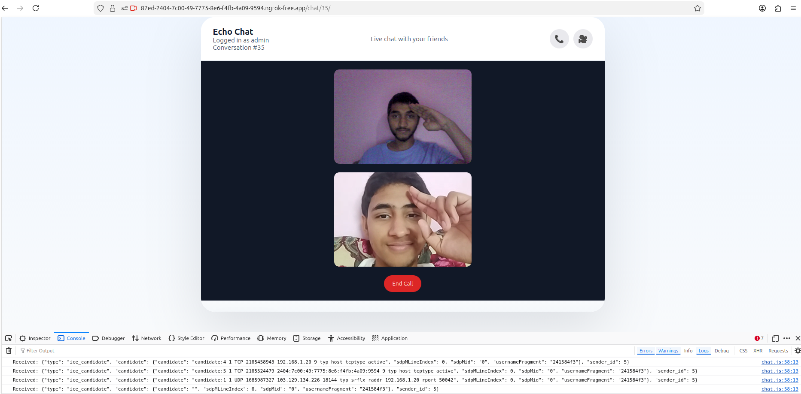

## Video Call


# Chat App
- This is a real-time chat system using Django + WebSockets.

* The Problem: Normal HTTP requests are one-way (you ask, server responds). Chat needs two-way, instant communication.
* The Solution: WebSockets — a persistent connection where server and client can both send messages anytime.

### ASGI SERVER
In order to handle the websocket requests we need to use asgi server. The asgi server checks if the request is HTTP or websocket and handles both the requests accordingly.

```
Client (Browser)
        ↓
   Makes a connection
        ↓
ASGI Server (Daphne / Uvicorn)        ← actual software running on your machine
        ↓
   asgi.py (your app's entry point)
        ↓
ProtocolTypeRouter  ← "what kind of connection is this?"
   ↙                        ↘
HTTP                      WebSocket
(normal request)          (persistent connection)
  ↓                              ↓
Django                    AuthMiddlewareStack  ← is user logged in?
handles it                       ↓
normally               URLRouter  ← which URL? /ws/chat/5/ ?
(views, templates)               ↓
                         ChatConsumer  ← your code runs here
                         (connect, receive, disconnect)
```

### Web Socket Routing
Just like Django's normal ```urls.py``` we use ```routing.py``` for routing websockets urls and send it to `consumers.py`.
```
Normal Django:
URL match → views.py

Django Channels (WebSocket):
URL match → consumers.py
```
- consumers.py is to WebSockets what views.py is to HTTP. ONLY difference is 
* A view handles one request and returns a response, done.
* A consumer stays open and handles multiple events — connect, receive, disconnect — over time.

### CONSUMERS
Consumers is like view for HTTP where we handle the websocket requests.
Here we make function to connect, disconnect, etc

## What is Django Channels?
Django Channels is an extension of Django that adds support for:
- WebSockets (real-time communication)
- Background tasks
- Long-lived connections
Without Channels:
* Django only handles HTTP (request/response)
With Channels:
* Django can handle real-time apps like chat, notifications, live updates


## CSRF (Cross Site Request Forgery)

CSRF is an attack where a hacker tricks your browser into sending an unwanted POST request to a Django application without your permission.
To prevent this, Django uses a CSRF token.

- When you load a page containing a POST form:
```<form method="POST">
    
```
Django does two things:
1. Sends a CSRF cookie to the browser
2. Adds a hidden CSRF token inside the form

How it works
* When you submit the form:
1. The browser sends the CSRF cookie
2. The form sends the hidden CSRF token
 
Django checks both values.
* If they match → request is allowed
* If not → request is blocked (403 error)

### The Complete Flow of how the call model in both users are hidden after user end call
```
User A clicks End Call
        │
        ▼
endCall()
        │
socket.send({
    type:"call_cancelled"
})
        │
        ▼
ChatConsumer.receive()
        │
group_send(chat_30)
        │
        ▼
────────────────────────────
│                          │
▼                          ▼
Consumer A            Consumer B
call_cancelled()      call_cancelled()
│                          │
send()                     send()
│                          │
▼                          ▼
Browser A             Browser B
socket.onmessage      socket.onmessage
│                          │
Hide UI               Hide UI
```


# Working of WebRTC

## Key Terms

### 1. ICE (Interactive Connectivity Establishment)

ICE is a framework built into the WebRTC engine that manages the process of establishing a connection between two peers.

Its responsibilities are:

- Collect all possible network addresses through which a device can be reached (called **ICE candidates**).
- Exchange these ICE candidates with the remote peer using the **signaling server**.
- Test different combinations of local and remote candidates to determine which connection works.
- Select the best available connection, preferably a direct peer-to-peer connection with the lowest latency.

### Types of ICE Candidates

#### 1. Host Candidate

The device's local network address.

**Example:**

```text
192.168.1.15
```

- Generated from the local network interface.
- Works only when both peers are on the same local network (LAN).

---

#### 2. Server Reflexive Candidate (srflx)

A public network address discovered using a **STUN server**.

**Example:**

```text
103.67.xx.xx
```

- Represents the public IP address and port assigned by the router (NAT).
- Used for direct communication over the internet.

---

#### 3. Relay Candidate

A candidate obtained from a **TURN server**.

```text
Peer A
   │
   ▼
TURN Server
   ▲
   │
Peer B
```

- Used when a direct peer-to-peer connection cannot be established.
- Media traffic is relayed through the TURN server.

---

## 2. STUN Server (Session Traversal Utilities for NAT)

A **STUN (Session Traversal Utilities for NAT)** server helps a device discover its **public IP address and port** as seen by the outside world.

Its purpose is to:

- Discover the public IP address.
- Help browsers communicate directly through NAT.
- Generate **Server Reflexive (srflx)** ICE candidates.

> **Note:** STUN only helps discover the public address. It does **not** relay audio, video, or data.

---

## 3. TURN Server (Traversal Using Relays around NAT)

A **TURN (Traversal Using Relays around NAT)** server is used when a direct peer-to-peer connection cannot be established due to:

- Symmetric NAT
- Strict firewalls
- Enterprise networks
- Other network restrictions

Instead of connecting directly:

```text
Peer A ─────────► Peer B
```

The connection is established through the TURN server:

```text
Peer A
   │
   ▼
TURN Server
   ▲
   │
Peer B
```

The TURN server relays all media (audio, video, and data) between the peers.

> **Note:** TURN is slower than a direct peer-to-peer connection because all traffic passes through the relay server.

---

## Relationship Between ICE, STUN, and TURN

```text
                ICE
                 │
      ┌──────────┴──────────┐
      │                     │
   Uses STUN            Uses TURN
      │                     │
Discovers Public IP     Relays Media
```

- **ICE** manages the entire connection establishment process.
- **STUN** helps discover the device's public IP address.
- **TURN** relays media when a direct connection is not possible.
- ICE gathers **Host**, **Server Reflexive (STUN)**, and **Relay (TURN)** candidates, exchanges them between peers, tests connectivity, and selects the best available path.

## Full Flow or How users are connected for call
```CALLER                                               RECEIVER
======                                               ========

Click Video Call
      │
      ▼
startVideoCall()
      │
      ▼
openLocalMedia()
(Camera + Mic Permission)
      │
      ▼
create localStream
      │
      ▼
localVideo.srcObject = localStream
      │
      ▼
video_call ------------------------------► Django Consumer
                                               │
                                               ▼
                               group_send(incoming_video_call)
                                               │
                                               ▼
                           incoming_video_call ----------------►

                                            Incoming Call Popup
                                            (Accept / Decline)

                                            Click Accept
                                                  │
                                                  ▼
                                           openLocalMedia()
                                         (Camera + Mic opens)
                                                  │
                                                  ▼
                                        createPeerConnection()
                                                  │
                                                  ▼
                                    Add local audio/video tracks
                                                  │
                                                  ▼
                                  call_accepted ----------------► Django Consumer
                                                                    │
                                                                    ▼
                                                          group_send(call_accepted)
                                                                    │
                                                                    ▼
                                 ◄---------------- call_accepted

Caller receives call_accepted
        │
        ▼
createPeerConnection()
        │
        ▼
Add local audio/video tracks
        │
        ▼
createOffer()
        │
        ▼
Offer SDP created
        │
        ▼
setLocalDescription(offer)
        │
        ▼
offer ------------------------------► Django Consumer
                                           │
                                           ▼
                                  group_send(offer)
                                           │
                                           ▼
                          ◄---------------- offer

Receiver receives Offer
        │
        ▼
setRemoteDescription(offer)
        │
        ▼
createAnswer()
        │
        ▼
Answer SDP created
        │
        ▼
setLocalDescription(answer)
        │
        ▼
answer ----------------------------► Django Consumer
                                          │
                                          ▼
                                 group_send(answer)
                                          │
                                          ▼
                        ◄---------------- answer

Caller receives Answer
        │
        ▼
setRemoteDescription(answer)

──────────────────────────────────────────────────────────────

ICE NEGOTIATION STARTS

Caller Browser
      │
      ▼
Find ICE Candidate #1
      │
      ▼
ice_candidate ----------------------► Django Consumer
                                          │
                                          ▼
                                 group_send(candidate)
                                          │
                                          ▼
                        ◄---------------- Receiver

Receiver
      │
      ▼
addIceCandidate()

──────────────────────────────────────────────

Receiver Browser
      │
      ▼
Find ICE Candidate #1
      │
      ▼
ice_candidate ----------------------► Django Consumer
                                          │
                                          ▼
                                 group_send(candidate)
                                          │
                                          ▼
                        ◄---------------- Caller

Caller
      │
      ▼
addIceCandidate()

──────────────────────────────────────────────

More ICE candidates...
Caller  ─────────────► Receiver
Receiver ────────────► Caller
(repeated automatically)

──────────────────────────────────────────────

ICE Connectivity Checks

Caller ◄──────────────► Receiver

Try Candidate A
      │
      ▼
Fail

Try Candidate B
      │
      ▼
Success

ICE Connection State = connected

──────────────────────────────────────────────

Peer-to-Peer connection established

Caller ◄══════════════════════════════════════► Receiver
         (Direct WebRTC Connection)

No more media passes through Django.

──────────────────────────────────────────────

Remote media starts arriving

Caller
      │
      ▼
ontrack()
      │
      ▼
remoteVideo.srcObject = receiver stream

Receiver
      │
      ▼
ontrack()
      │
      ▼
remoteVideo.srcObject = caller stream

──────────────────────────────────────────────

🎥 Video flowing directly Browser ⇄ Browser
🎤 Audio flowing directly Browser ⇄ Browser

Django's role is now finished.
```